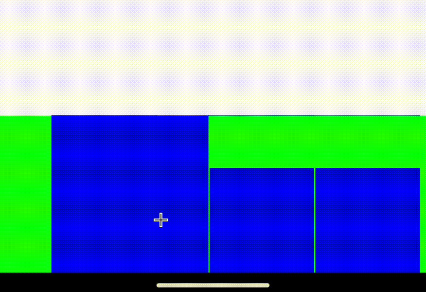

# ExpandableItemAnimationComponent

这个项目是一个 Android 动画组件

## 功能描述

这个演示组件包含三个大小相同的视图，具有以下特性：

1. 点击任意视图时，被点击的视图会放大。
2. 如果其他视图处于放大状态，它们会同时缩小回原始大小。
3. 三个视图之间的间距在整个动画过程中保持不变。

## 预览



## 使用方法
1. 将[Component.kt](app/src/main/java/com/example/myapplication/Component.kt) 添加到你的项目中
2. 在布局文件中使用该组件：
```xml
<com.example.myapplication.Component
    android:id="@+id/component"
    android:layout_width="match_parent"
    android:layout_height="wrap_content"/>
```
3. 调用`component.setupRealView(view1, view2, view3)`来设置你具体要做动画的view
